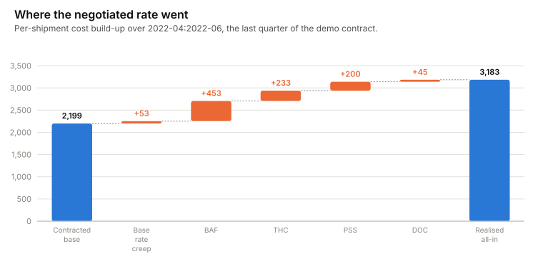
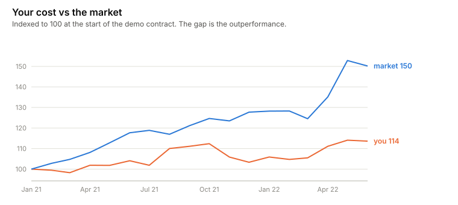
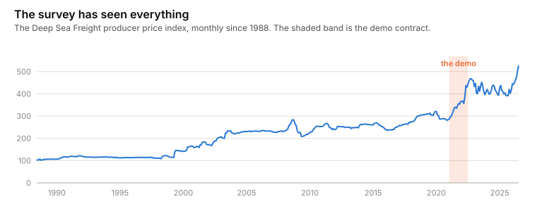
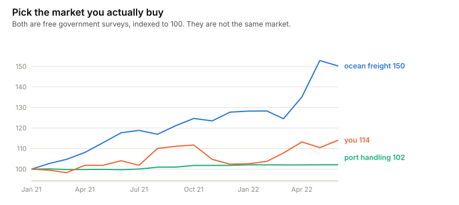
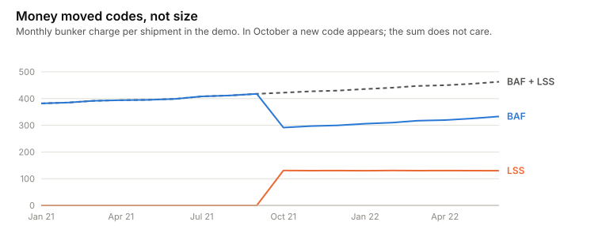

# rate-erosion

[](https://github.com/rikardotoro/rate-erosion/actions/workflows/ci.yml)

**You negotiated −8%. You paid +3%. Here is where it went.**

Negotiated discounts erode. The base gets billed a little high, surcharges
creep, a peak-season charge appears, exchange rates move, and your own traffic
drifts to the dearer route. This tool reads your cost lines, splits the gap
piece by piece, and then asks the question that actually judges the deal:
how did you do against the market?

<picture>
  <source media="(prefers-color-scheme: dark)" srcset="docs/charts/waterfall-dark.svg">
  
</picture>

## The 30-second version

```bash
uvx --from git+https://github.com/rikardotoro/rate-erosion rate-erosion --demo
```

<!-- BEGIN OUTPUT -->
```
What one shipment cost you, Apr–Jun 2022      
┏━━━━━━━━━━━━━━━━━━━━━━━━━━━━━━━━━━┳━━━━━━━━━━━━━━┓
┃ Step                             ┃ $ / shipment ┃
┡━━━━━━━━━━━━━━━━━━━━━━━━━━━━━━━━━━╇━━━━━━━━━━━━━━┩
│ Contracted base                  │        2,189 │
│ Base rate creep                  │          +50 │
│ BAF — fuel surcharge             │         +326 │
│ THC — terminal handling          │         +235 │
│ PSS — peak season surcharge      │         +200 │
│ LSS — low-sulphur fuel surcharge │         +130 │
│ DOC — documentation fee          │          +45 │
│ Realised all-in                  │        3,175 │
└──────────────────────────────────┴──────────────┘
Top row: the rate you negotiated. Bottom row: what you actually paid. Every line
in between is a piece of the gap.
  Why total spend changed, Jan–Mar 2021 →  
               Apr–Jun 2022                
┏━━━━━━━━━━━━━━━━━━━━━━━━━━━━━━━┳━━━━━━━━━┓
┃ Reason                        ┃       $ ┃
┡━━━━━━━━━━━━━━━━━━━━━━━━━━━━━━━╇━━━━━━━━━┩
│ Number of shipments (volume)  │ -14,003 │
│ What carriers charged (price) │ +55,948 │
│ Which lanes you used (mix)    │ +16,258 │
│ Exchange rates (FX)           │  -5,504 │
│ Total change                  │ +52,700 │
└───────────────────────────────┴─────────┘
The four reasons add up to the total exactly — nothing is left over.

Your cost per shipment moved +13.4% between the two periods (183 shipments, then
178).
The market (PPI: Deep Sea Freight Transportation (BLS)) moved +50.2% over the 
same time. You did 36.8% points better than the market.
Your all-in rate stepped +9.8% in Aug 2021 (2,851 → 3,131 per shipment).
Your all-in rate stepped -6.0% in Nov 2021 (3,131 → 2,942 per shipment).
Your all-in rate stepped +8.0% in Apr 2022 (2,942 → 3,176 per shipment).
Worth a look: BAF (fuel surcharge) and LSS (low-sulphur fuel surcharge) mirror 
each other month by month while their sum stays flat. That usually means money 
was relabelled between charge codes, not saved.
```
<!-- END OUTPUT -->

Where the money went, why total spend changed (four reasons that sum exactly
— no leftover), and whether the market excuses it.

## Against the market

In the demo, cost per shipment rises 13% — which looks bad until you see the
market rose 50% over the same 18 months. Whoever locked that contract saved a
fortune, and a report showing only "+13%" punishes them for it.

<picture>
  <source media="(prefers-color-scheme: dark)" srcset="docs/charts/market-dark.svg">
  
</picture>

The price line stays clean: currency moves and route shifts are separated out
(exchange rates come from the Fed's daily data automatically), so "price"
only ever means the carrier actually charged more.

## What "the market" is

The default benchmark is the **Producer Price Index for Deep Sea Freight** —
the US Bureau of Labor Statistics asks ocean carriers every month what they
charge, and has since 1988. Free, public domain, checkable by anyone.

<picture>
  <source media="(prefers-color-scheme: dark)" srcset="docs/charts/history-dark.svg">
  
</picture>

Even free surveys are different markets — over the demo term ocean freight
rose 50% while port handling rose 2%. The choice of yardstick *is* the
analysis:

<picture>
  <source media="(prefers-color-scheme: dark)" srcset="docs/charts/benchmarks-dark.svg">
  
</picture>

The Baltic Dry Index is refused by name — it tracks bulk cargo, not
containers. SCFI, WCI and FBX are the right concept but paywalled, so results
built on them couldn't be checked by readers. One true dollar rate is
available: `--benchmark drewry` fetches the USDA-hosted Drewry spot rate for
Los Angeles→Shanghai 40ft boxes (monthly since 2012, US-export direction,
fetch-only — Drewry attribution, so no copy ships in this repo).

## The patterns underneath

**When did the rate move?** Changepoints turn "costs went up" into dates and
sizes — in the demo, three steps that are the peak-season surcharge switching
on and off.

**Is money being relabelled?** The classic way around a price cap: lower one
charge, add a new one for the same amount. The total stays flat; a
totals-only report sees nothing. In the demo a "new" low-sulphur surcharge
appears in October 2021 for exactly what the fuel surcharge gave up, and the
tool says so: *money was relabelled, not saved.*

<picture>
  <source media="(prefers-color-scheme: dark)" srcset="docs/charts/relabel-dark.svg">
  
</picture>

## Do this in your own tools

**Excel** — per-shipment cost of one charge type; a pivot per quarter is
already the waterfall:

```
=SUMIFS(amount, charge_code, "BAF") / SUMPRODUCT(1/COUNTIF(shipments, shipments))
```

**Power BI (DAX)** — the price effect per lane; mix and volume follow the
same pattern with the references swapped:

```
Price Effect :=
SUMX(
    VALUES(Shipments[lane]),
    [Cur Shipments] * ([Cur Unit Cost] - [Base Unit Cost])
)
```

**SQL** — run for both periods and subtract:

```sql
SELECT charge_code,
       SUM(amount) / COUNT(DISTINCT shipment) AS per_shipment
FROM cost_lines
WHERE date BETWEEN '2022-04-01' AND '2022-06-30'
GROUP BY charge_code
ORDER BY per_shipment DESC;
```

What none of these do: keep FX and route mix out of the price line, benchmark
against the market, or catch the relabelling trick.

## Five ways to get this wrong

1. **Using the Baltic Dry Index** — bulk cargo, not containers.
   → [`tests/test_benchmark.py::test_baltic_dry_index_is_refused_with_explanation`](tests/test_benchmark.py)
2. **Calling a route change a price change.**
   → [`tests/test_decompose.py::test_mix_shift_is_not_booked_as_price`](tests/test_decompose.py)
3. **Calling a currency move a price change.**
   → [`tests/test_decompose.py::test_fx_movement_is_not_a_rate_change`](tests/test_decompose.py)
4. **Comparing your rate change to nothing** — +13% means nothing without the
   market next to it.
   → [`tests/test_benchmark.py::test_verdict_reports_relative_points`](tests/test_benchmark.py)
5. **Trusting a flat total** — charges can be relabelled underneath it.
   → [`tests/test_patterns.py::test_planted_shuffle_is_detected`](tests/test_patterns.py)

## Run it

```bash
uvx --from git+https://github.com/rikardotoro/rate-erosion rate-erosion --demo
uvx --from git+https://github.com/rikardotoro/rate-erosion rate-erosion \
  --data cost_lines.csv --contract contract.csv \
  --baseline 2025-01:2025-03 --current 2026-04:2026-06
```

**Cost lines CSV** — one row per charge per shipment; names auto-detected,
forceable with `--map canonical=your_column`:

| Column | Required | Meaning |
|---|---|---|
| `shipment` | yes | Shipment / BL / container reference |
| `date` | yes | Charge or invoice date |
| `lane` | yes | Route |
| `charge_code` | yes | BAS, BAF, THC… base codes group as "base" |
| `amount` | yes | Amount in its own currency |
| `currency` | no | Defaults to USD |
| `fx_rate` | no | Leave out — filled from the Fed's daily rates |

**Contract CSV** — `lane`, `base_rate` (per shipment).

`--baseline` / `--current` pick the periods (default: first vs last three
months). `--benchmark` picks the index (`none` to skip). `--json` for
machines.

## What this doesn't do

- Judge whether a surcharge was legitimate — that conversation is yours.
- Work without your contracted rate per lane.
- Price a specific lane: the index is a broad US proxy, and says so.
- Use real invoices in the demo: the cost lines are synthetic (seeded,
  disclosed in [`src/rate_erosion/examples/SOURCE.md`](src/rate_erosion/examples/SOURCE.md)); the index and
  exchange rates are real.

## Is any of this actually tested?

Yes — including the claims: the four effects summing exactly is a test, and
so is the planted relabelling. The demo output above is produced by running
the tool. CI runs on 3.11 and 3.12.

<details>
<summary><strong>The full test list</strong> — regenerated by <code>scripts/render_readme_output.py</code>, so it can't drift</summary>

<!-- BEGIN TESTS -->
```
62 passed

tests/test_benchmark.py::test_default_series_is_registered PASSED
tests/test_benchmark.py::test_resolve_accepts_a_known_id PASSED
tests/test_benchmark.py::test_baltic_dry_index_is_refused_with_explanation PASSED
tests/test_benchmark.py::test_unknown_series_lists_the_supported_ones PASSED
tests/test_benchmark.py::test_load_series_parses_fredgraph_csv PASSED
tests/test_benchmark.py::test_pct_change_uses_asof_values PASSED
tests/test_benchmark.py::test_verdict_reports_relative_points PASSED
tests/test_benchmark.py::test_usda_aliases_resolve PASSED
tests/test_benchmark.py::test_load_usda_csv_picks_la_40ft PASSED
tests/test_cli.py::test_cli_runs_and_reports PASSED
tests/test_cli.py::test_cli_json_output_is_valid PASSED
tests/test_cli.py::test_cli_refuses_baltic_dry PASSED
tests/test_data.py::test_detects_canonical_names PASSED
tests/test_data.py::test_detects_common_aliases PASSED
tests/test_data.py::test_override_beats_detection PASSED
tests/test_data.py::test_missing_required_column_names_the_column PASSED
tests/test_data.py::test_base_codes_are_recognised_case_insensitively PASSED
tests/test_data.py::test_load_defaults_currency_and_fx PASSED
tests/test_data.py::test_unparseable_date_names_the_row PASSED
tests/test_data.py::test_non_numeric_amount_names_the_row PASSED
tests/test_data.py::test_load_contract PASSED
tests/test_data.py::test_contract_rejects_non_positive_rate PASSED
tests/test_decompose.py::test_effects_sum_exactly_to_total_change PASSED
tests/test_decompose.py::test_mix_shift_is_not_booked_as_price PASSED
tests/test_decompose.py::test_fx_movement_is_not_a_rate_change PASSED
tests/test_decompose.py::test_pure_volume_change PASSED
tests/test_decompose.py::test_new_lane_in_current_period_does_not_crash PASSED
tests/test_demo_data.py::test_demo_files_are_small PASSED
tests/test_demo_data.py::test_demo_loads_and_spans_the_contract_term PASSED
tests/test_demo_data.py::test_demo_is_reproducible PASSED
tests/test_demo_data.py::test_offline_fred_slice_loads PASSED
tests/test_demo_data.py::test_demo_shuffle_is_detected PASSED
tests/test_fx.py::test_usd_lines_fill_with_one PASSED
tests/test_fx.py::test_eur_fills_asof_the_line_date PASSED
tests/test_fx.py::test_units_per_usd_series_is_inverted PASSED
tests/test_fx.py::test_user_supplied_fx_is_never_touched PASSED
tests/test_fx.py::test_unknown_currency_says_how_to_fix_it PASSED
tests/test_fx.py::test_date_before_series_start_raises PASSED
tests/test_patterns.py::test_monthly_matrix_is_per_shipment PASSED
tests/test_patterns.py::test_planted_shuffle_is_detected PASSED
tests/test_patterns.py::test_independent_movement_is_not_a_shuffle PASSED
tests/test_patterns.py::test_joint_increases_are_not_a_shuffle PASSED
tests/test_patterns.py::test_too_few_months_returns_none PASSED
tests/test_patterns.py::test_changepoints_find_a_single_step PASSED
tests/test_patterns.py::test_changepoints_ignore_pure_noise PASSED
tests/test_patterns.py::test_changepoints_find_two_steps PASSED
tests/test_patterns.py::test_rate_regimes_report_step_direction PASSED
tests/test_periods.py::test_parse_period_is_month_inclusive PASSED
tests/test_periods.py::test_parse_period_rejects_garbage PASSED
tests/test_periods.py::test_explicit_periods_select_rows PASSED
tests/test_periods.py::test_default_periods_are_first_and_last_three_months PASSED
tests/test_periods.py::test_empty_period_raises PASSED
tests/test_report.py::test_analysis_counts_and_change PASSED
tests/test_report.py::test_verdict_included_when_market_given PASSED
tests/test_report.py::test_to_dict_is_json_serialisable PASSED
tests/test_smoke.py::test_version_is_exposed PASSED
tests/test_smoke.py::test_unknown_series_error_is_a_rate_erosion_error PASSED
tests/test_waterfall.py::test_shipment_count_is_distinct_references PASSED
tests/test_waterfall.py::test_base_codes_fold_into_base_category PASSED
tests/test_waterfall.py::test_waterfall_steps_sum_to_realised PASSED
tests/test_waterfall.py::test_surcharges_sorted_by_impact PASSED
tests/test_waterfall.py::test_lane_missing_from_contract_is_an_error PASSED
```
<!-- END TESTS -->

</details>

## Licence

MIT.
